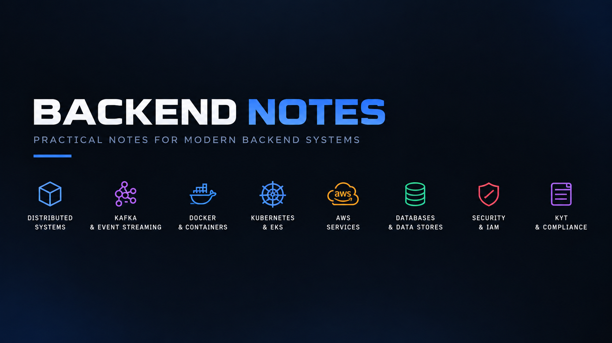

This repository is my practical backend engineering notebook, built while studying the systems and infrastructure behind modern production backends. It covers the concepts I want to understand well enough to explain and work with in a real engineering environment, including backend architecture, microservices, event-driven systems, Kafka, reliability patterns, design patterns, Docker, Kubernetes, AWS infrastructure, databases, security, and KYT-related backend flows. The notes focus less on memorizing theory and more on understanding how the pieces connect, why certain architectural choices are made, what can fail in distributed systems, and how those failures are handled in practice.